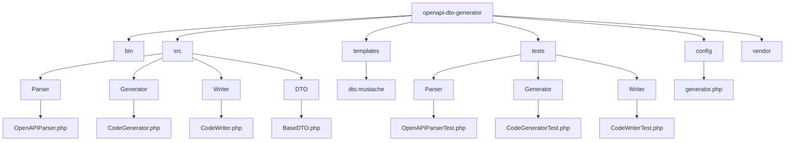

# OpenAPI DTO Generator

OpenAPI DTO Generator je konzolový nástroj v PHP 8.3, který načte OpenAPI specifikaci (soubor `openapi.json`) a na základě definic ve schématech vygeneruje immutable DTO třídy pro requesty i response. Generované třídy jsou navrženy dle SOLID principů a přístup k interním hodnotám je zajištěn výhradně prostřednictvím veřejných getter metod, což umožňuje jejich následnou customizaci potomky.

## Struktura projektu

Podrobnější dokumentaci naleznete v souboru [ZADANI.md](ZADANI.md).

## Požadavky

- PHP 8.3 nebo novější
- Composer
- (Volitelně) Symfony HttpFoundation (pro práci s HTTP requesty)
- Pest (pro jednotkové testy)

## Instalace

1. Naklonujte repozitář:
   git clone https://github.com/vas-projekt/openapi-dto-generator.git
   cd openapi-dto-generator

2. Nainstalujte závislosti pomocí Composeru:
   composer install

## Použití

### Spuštění generátoru

Spusťte generátor z příkazové řádky:
php bin/openapi-dto-generator --input=/cesta/k/openapi.json --output=/cesta/k/vygenerovanym/tridam --namespace="App\DTO"

**Parametry:**

- --input – cesta k souboru `openapi.json` (může být také URL)
- --output – adresář, kam se vygenerují DTO třídy
- --namespace – kořenový namespace pro generované třídy

### Generované DTO třídy

Každá vygenerovaná třída:
- Má private readonly vlastnosti, které jsou inicializovány pouze v konstruktoru.
- Neposkytuje veřejné setter metody – přístup k interním hodnotám je realizován výhradně přes veřejné getter metody (např. getName(), getId() apod.). Díky tomu mohou potomci tyto metody přepsat a upravit chování podle potřeb.
- Obsahuje statickou tovární metodu fromRequest(Request $request): self, která vytvoří instanci z HTTP requestu.

### Příklad použití generovaného DTO

use App\DTO\UserRequestDTO;
use Symfony\Component\HttpFoundation\Request;

// Vytvoření HTTP requestu (např. pomocí Symfony HttpFoundation)
$request = Request::createFromGlobals();

// Vytvoření DTO pomocí tovární metody
$userDto = UserRequestDTO::fromRequest($request);

// Přístup k hodnotám přes gettery
echo $userDto->getName();

### Spuštění testů

Testy jsou psány pomocí Pest (https://pestphp.com/) frameworku. Spuštění testů provedete příkazem:
vendor/bin/pest

Testy ověřují:
- Správné načtení a parsování OpenAPI specifikace.
- Generování DTO tříd se správnými vlastnostmi a getter metodami.
- Immutabilitu generovaných objektů.

## Rozšíření a přizpůsobení

Projekt je modulární a snadno rozšiřitelný:
- Šablony: Kód se generuje pomocí Mustache šablon. Pro úpravu vygenerovaného kódu upravte šablony v adresáři `templates/`.
- Konfigurace: Soubor `config/generator.php` umožňuje nastavit vlastní pravidla (např. mapování typů, prefixy/suffixy tříd apod.).

## Architektura

Projekt je rozdělen do následujících modulů:
- Parser: Načítá a zpracovává OpenAPI specifikaci.
- Generátor kódu: Převádí interní datové struktury na PHP třídy pomocí šablon.
- Writer: Zapisuje generovaný kód do souborového systému.
- Tests: Jednotkové testy (Pest) ověřující klíčovou funkčnost.

Celkově je cílem robustní a udržovatelné řešení s jasně oddělenými odpovědnostmi, které podporuje customizaci (přes přepsání getter metod) a umožňuje snadnou integraci do libovolných projektů.

## Přispění

Máte-li nápady na zlepšení nebo objevíte chyby, vytvořte prosím issue nebo pull request v repozitáři.

## Licence

Tento projekt je licencován pod [MIT licencí](LICENSE).
